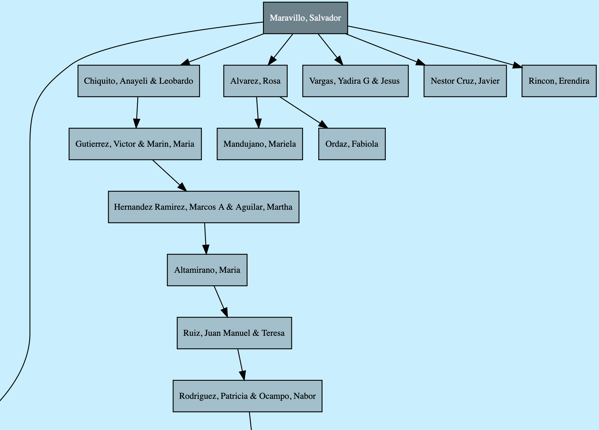

# AmwayAssociateTree

Generate an SVG image of your tree with all your business associates.

## Usage
Clone the repository
```shell
git clone https://github.com/villaleo/AmwayAssociateTree
```
Make sure you have **go** installed. If you don't have it, get it from [here](https://go.dev/doc/install). 
```shell
go version
```
Change directory to the project directory.
```shell
cd AmwayAssociateTree
```
Build the project. A few warnings are expected. That's because of an internal file in the `go-graphviz` library,
so everything should be alright.
```shell
go build .
```
Before running the executable, make sure you remove the first two lines from the CSV file! The first line in your
CSV file should be similar to:
```
"Nivel de IBO","Número de IBO auspiciador","Numero de IBO","País","Nombre","Fecha de ingreso","Teléfono","Correo electrónico","Dirección","PPV","GPV","Porcentaje de bonif","GBV","PV de VCS","Sin PV de VCS","% VCS","Total de clientes","Puntos para el siguiente nivel"
```
Of course, in your language! Mine is in Spanish.

After removing the lines, run the executable.
```shell
./amway-associate-tree my-associates-data.csv -o tree
```
You should see `tree.svg` was generated. Here's an example of how the generated tree looks:


## License
```
This program is free software: you can redistribute it and/or modify it under the terms of the
GNU General Public License as published by the Free Software Foundation, either version 3 of
the License, or (at your option) any later version. This program is distributed in the hope
that it will be useful, but WITHOUT ANY WARRANTY; without even the implied warranty of
MERCHANTABILITY or FITNESS FOR A PARTICULAR PURPOSE. See the GNU General Public License for
more details. You should have received a copy of the GNU General Public License along with
this program. If not, see <https://www.gnu.org/licenses/>. 
```